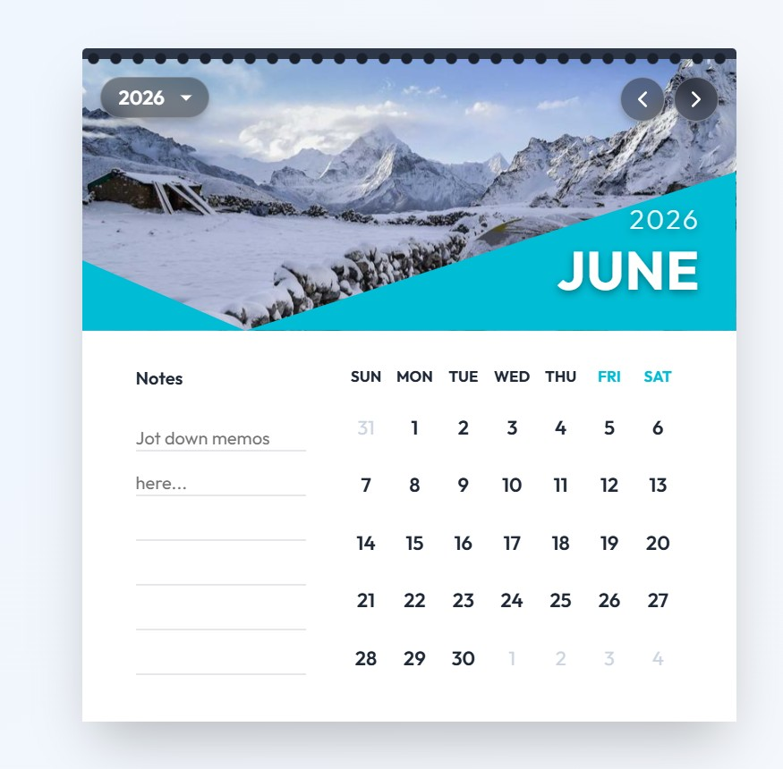

# 🗓️ Interactive Wall Calendar


A polished, hyper-realistic dual-layered digital wall calendar built with React and Vanilla CSS. Inspired by physical spiral-bound calendars, this interactive application delivers a seamless 3D page-flip experience infused with dynamic theming and modern glassmorphism UI components.

## ✨ Core Features

- **Hyper-Realistic 3D Page Flips**: Experience fluid, physics-based 3D page transitions exactly like pulling a genuine paper calendar page downward or upward over a spiral wire binding, complete with integrated 500ms directional motion blur effects.
- **Double-Layered Rendering**: Features a static predictive background rendering architecture ensuring you never see a blank white screen during transitions.
- **Dynamic Thematic Coloring**: High-performance UI variables seamlessly map color palettes directly to the specific month, automatically updating shape colors and data grids on the fly.
- **Integrated Note Persistence**: Jot down quick memos or tasks effortlessly. Utilizing local device storage (`localStorage`), your daily thoughts persist predictably across page turns and hard browser reloads. 
- **Century-Wide Discovery Engine**: Avoid painful clicking with an elegant dark glassmorphic dropdown selector spanning an exhaustive 100-year chronological index for immediate time-travel.
- **Intuitive Range Selection**: Includes real-time current date markers securely mapped alongside a fully functional, click-to-highlight date-range selection engine (`date-fns`).
- **Calculated Geometric Responsive Design**: Hand-crafted CSS geometry utilizing responsive `clip-path` mappings adapt to viewport compression to ensure pristine topography readability against randomized background imagery.

## 🛠️ Technology Stack

- **Framework**: Vite + React
- **Date Architecture**: `date-fns` 
- **Design System**: Vanilla Web CSS3 (Variables, 3D Transforms, Polygon Masks, Glassmorphism)
- **Symbology**: `lucide-react`
- **Dynamic Imagery**: `picsum.photos` API

## 🚀 Quick Start Guide

To run this application locally, ensure you have Node.js installed, then follow these simple setup steps:

1. **Clone the repository:**
   ```bash
   git clone https://github.com/AnujShrivastava01/Calendar.git
   cd Calendar
   ```

2. **Install project dependencies:**
   ```bash
   npm install
   ```

3. **Spin up the Vite development server:**
   ```bash
   npm run dev
   ```

4. **Experience the Application:**
   Navigate to [http://localhost:5173](http://localhost:5173) in your favorite browser.

## 📸 Component Showcase

<p align="center">
  
</p>

---

**Designed and coded meticulously with a focus on UI fluidity and UX physics.**
